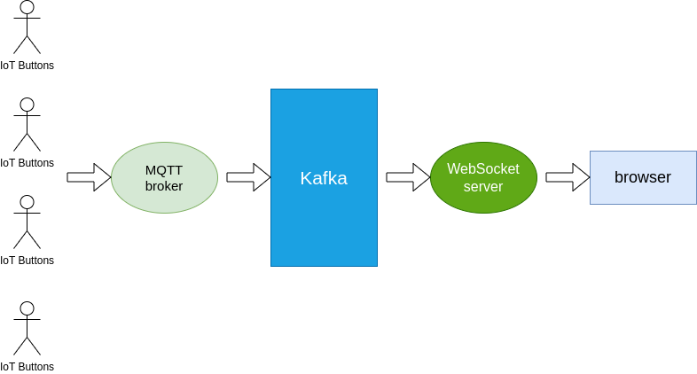
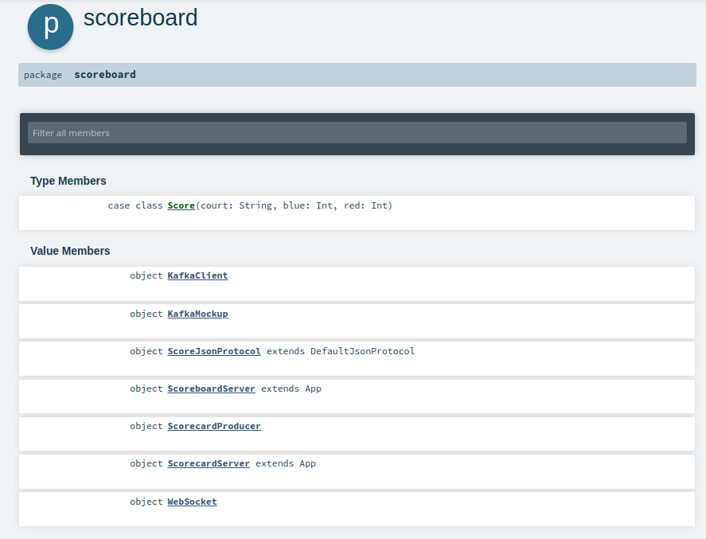
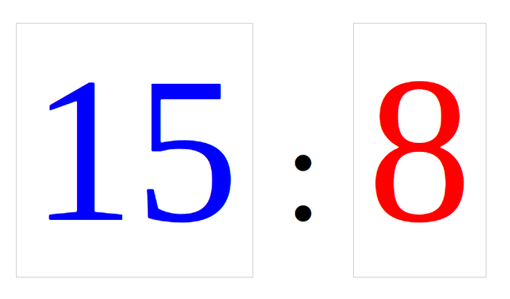
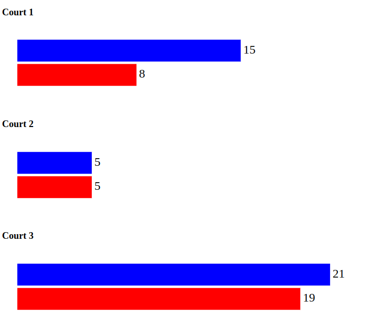

## Volleyball Tournament Scoreboard

### Problem Statement
Collecting scorecard data from volleyball courts and post scores on scoreboard.

---
### Solution Overview
Automated scorecard collection and posting scores on scoreboard using IoT devices and Kafka

---
### Development Stack
- Scala and sbt (Compiler and Build tool)
- Apache Kafka Java Client library (Producer and Consumer)
- Akka-Http Scala library (Http and WebSocket server)
- D3.js (Browser visualization)

---
### Code structure (Classes and Objects)

---
### Solution - Score collection   
**Scorecard** data is collected from volleyball courts and posted on Scoreboard

---
### Solution - Score Visualization   
**Scoreboard** displays scores from all courts in real-time

