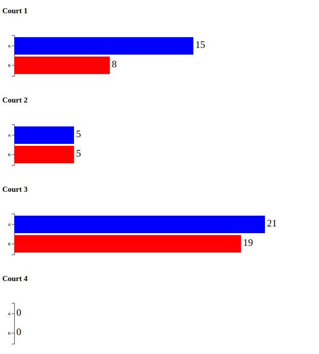

## Volleyball Tournament Scoreboard

### Problem Statement
Collecting scorecard data from volleyball courts and post scores on scoreboard.

---
### Solution Overview
Automated scorecard collection and posting scores on scoreboard using IoT devices and Kafka

---
### Development Stack
- Scala and sbt (Compiler and Build tool)
- Apache Kafka Java Client library (Producer and Consumer)
- Akka-Http Scala library (WebSocket server)
- D3.js (Browser visualization)

---
### Code structure (Classes and Objects)

---
### Solution Showcase
Browser visualization of scorecard data

